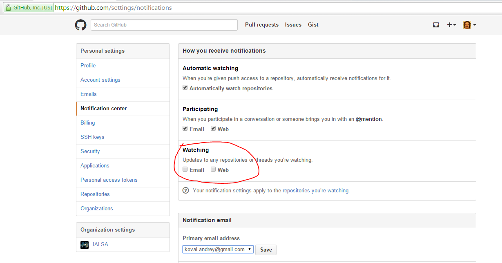

News and Announcements
---

##How to Disable update notification

So that you are not spammed by minor updates of the repository's scripts, please make sure you uncheck the option for notification of the *watched* repository as shown below  
  
You can access this screen after login into your [github](https://github.com/login) account and going to [your notification settings](https://github.com/settings/notifications)