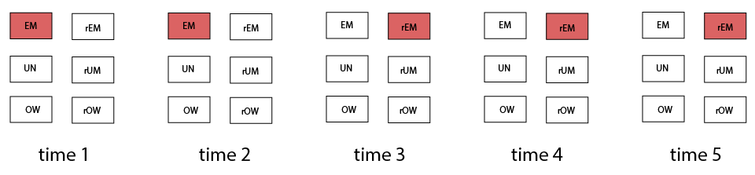

## Foundational observations

**Retirement** is a complex construct. We can begin conceptualizing it by recognizing the following observations:   
 - people who retire are of a specific **social class** since they are those, generally, who have jobs from which they are not being fired and that are stable. However, they have made a choice to leave because of a lack of financial need to work. This the stereotypical, but in fact, a small, group.  
 - those who retire are usually engaged in some kinds of activities, though not always, and those activities may include things like bridge jobs or new jobs that are just as **active**. As a result, a substantial proportion of people who tell you that they retire are working again within 5 years   
 - retirement is often conceptualized as not working when older, where in fact many people who were outside of the labor force just **age out** into “retirement”   
 - some people who are fired from a job or let go at say 50 years old, then spend a lot of time **unemployed**, cannot find new employment and then just start calling themselves “retired”    
 
 *Collaboratores are welcome to expand and edit this list*  
 
## Retirement metric 
 
These and other nuances of the retirement construct require the analytic strategy to account for the **progression of individuals through a series of states that describe their relationship with the workforce**, or **retirement trajectory**, as I suggest we call it for short. A retirement trajectory traces bivariate relationship between time (X) and retirement (Y). 

The properties of the (Y) scale thus must reflect the theoretical considaration about the retirement construct and anticipate the statistical models that will be reconstructing the behavior of this variable (Y) through time. This metric must be as **simple** possible to maximize model parsimony, yet  **flexible** enough to address the complexity of the research question. The metric also will serve as cross-study harmonization device: the retirement data from each study must conform to the simplification of the chosen scale.  Different studies may record retirement data ideosyncratically; we will need to decide along the way what granularity of retirement data a study must contain in order to qualify into Gothenburg Collective.

Two decisions will shape the discussion:  
> 1. How many categories should retirement scale contain?   
> 2. What should these categories be?

I suggest we look at a few conceptualization before we settle on the one that will be translated into stastistical models and estimated. With that said, please be aware of the explorative nature of the expositions to follow. Their intention is to to facilitate discussion and give us some mental landmarks to navigate this development, not to present a definitive point of view. It is very likely that we would have to adjust our conceputualization of retirmement by the time we reach Milestone 4 for the first time, so having a spacious arsenal of conceptualiation would be very useful. 

## A6 

The research question distinguishes 3 major relationship with the workforce an idividual may have:   
 - employed  (EM)  
 - unemployed (UN)   
 - outside of workforce (OW)    
 
As people in these categories progress through life, they may start identifying themselves or be classified as "retired", a somewhat loose lable, implying some combination of age, health, and financial circumstances. In order to address the research question it is not sufficient to know whether the person has retired or not: the dynamics of the relationship with the workforce prior to "retirement" forms the basis of comparing cognitive, physical, and well-being trajectories. In light of this we may think of these retireers as qualitatively different, depending on what relationship with the workforce they had in the past:
 - retired from being employed (rEM)  
 - retired from being unemployed (rUM)  
 - retired from being outside workforce (rOW)   
 
 This gives us s6x mutually exclusive categories that exhaustively describe individual's relationship with workfoce in time. Using diagrammatic expression we can depict a person's retirement trajectory in the following way:
 
 
## E5
